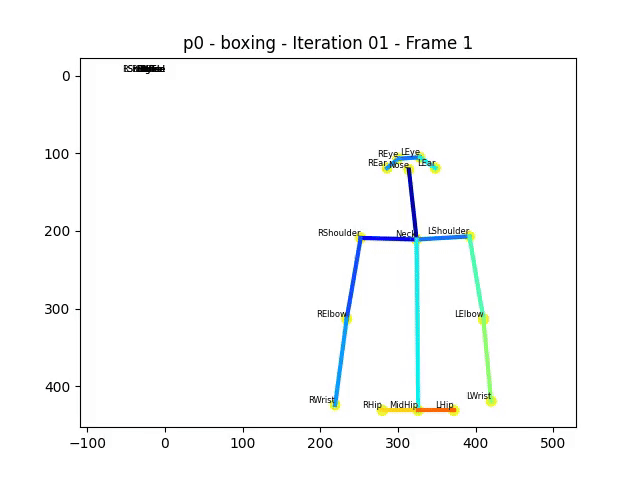
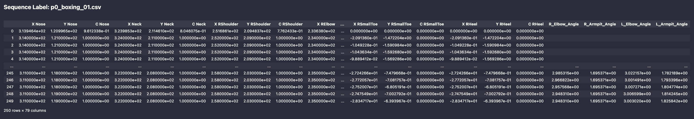
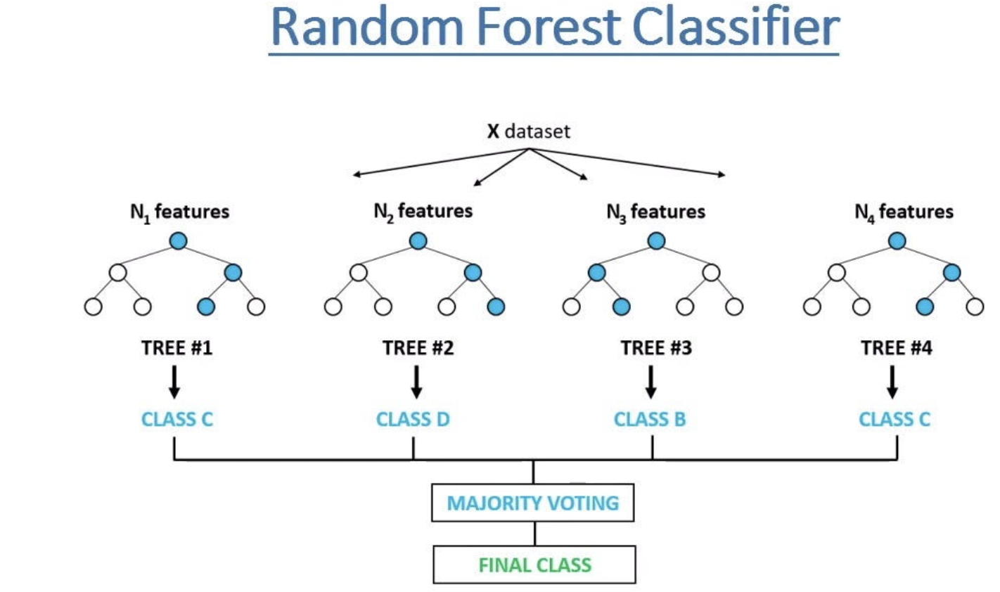

# Motions classification project

This project aimed to use encoding techniques, proximity measures, and classification methods to train a model that predicts the actions in the test dataset.

#### Dataset example:

## Features:
- Data loading/preparation.
- Data vizualization for dataset adjustmnents. was use the next plots: Distribution of Keypoint Confidences, Heatmap of Keypoint Activit, Scatter Plots for Keypoints.
- Classification model design and evaluation. The model was trained using RandomForestClassifier.

**Why RandomForestClassifier?**

 - first of all, we were looking for the relatively simple (but power) model that would work good with 
 our table numerical datasets including classes;
 - in our datasets we also have feature importance (confidences) for each point. 
 Random forest understands which keypoints or derived statistics (e.g., mean X-coordinate, standard deviation) 
 are most critical for distinguishing actions;
 - it works good with table (structured) data;
 - it requires minimal preprocessing (so in our case we didn't scale data. we normalize it, but we got the same result as without normalization);
 - it works with categorical outputs (classes in our case);
 - works good with noisy data. it useful for us because in some sequences we have 0 confidences and missing keypoints;  
